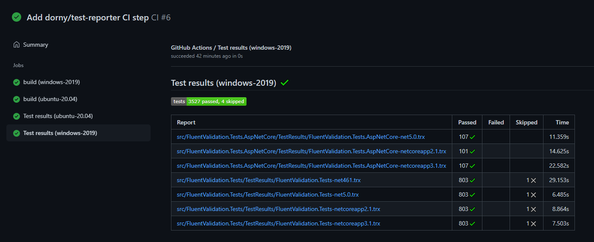
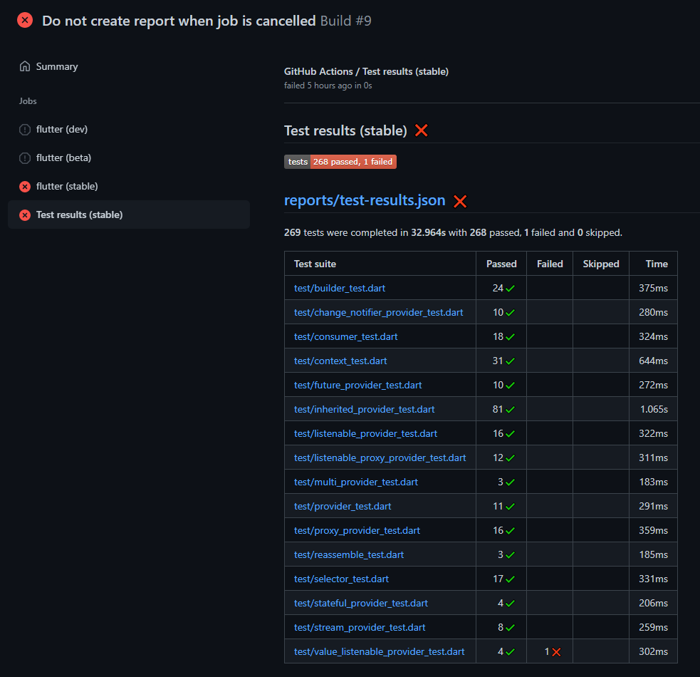
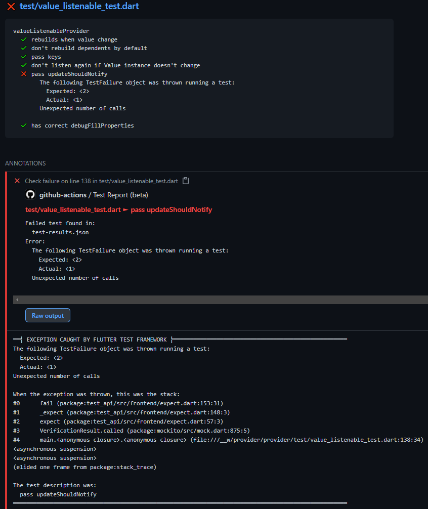
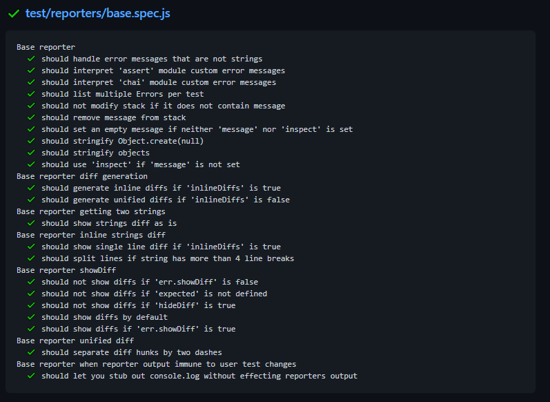

# Test Reporter

This [Github Action](https://github.com/features/actions) displays test results from popular testing frameworks directly in GitHub.

✔️ Parses test results in XML or JSON format and creates nice report as Github Check Run

✔️ Annotates code where it failed based on message and stack trace captured during test execution

✔️ Provides final `conclusion` and counts of `passed`, `failed` and `skipped` tests as output parameters

**How it looks:**
|||||
|:--:|:--:|:--:|:--:|

**Supported languages / frameworks:**
- .NET / [xUnit](https://xunit.net/) / [NUnit](https://nunit.org/) / [MSTest](https://github.com/Microsoft/testfx-docs)
- Dart / [test](https://pub.dev/packages/test)
- Flutter / [test](https://pub.dev/packages/test)
- Java / [JUnit](https://junit.org/)
- JavaScript / [JEST](https://jestjs.io/) / [Mocha](https://mochajs.org/)

For more information see [Supported formats](#supported-formats) section.

Do you miss support for your favorite language or framework?
Please create [Issue](https://github.com/dorny/test-reporter/issues/new) or contribute with PR.

## Example

Following setup does not work in workflows triggered by pull request from forked repository.
If that's fine for you, using this action is as simple as:

```yaml
on:
  pull_request:
  push:
jobs:
  build-test:
    name: Build & Test
    runs-on: ubuntu-latest
    steps:
      - uses: actions/checkout@v2     # checkout the repo
      - run: npm ci                   # install packages
      - run: npm test                 # run tests (configured to use jest-junit reporter)

      - name: Test Report
        uses: dorny/test-reporter@v1
        if: success() || failure()    # run this step even if previous step failed
        with:
          name: JEST Tests            # Name of the check run which will be created
          path: reports/jest-*.xml    # Path to test results
          reporter: jest-junit        # Format of test results
```

## Recommended setup for public repositories

Workflows triggered by pull requests from forked repositories are executed with read-only token and therefore can't create check runs.
To workaround this security restriction, it's required to use two separate workflows:
1. `CI` runs in the context of the PR head branch with the read-only token. It executes the tests and uploads test results as a build artifact
2. `Test Report` runs in the context of the repository main branch with read/write token. It will download test results and create reports

**PR head branch:**  *.github/workflows/ci.yml*
```yaml
name: 'CI'
on:
  pull_request:
jobs:
  build-test:
    runs-on: ubuntu-latest
    steps:
      - uses: actions/checkout@v2         # checkout the repo
      - run: npm ci                       # install packages
      - run: npm test                     # run tests (configured to use jest-junit reporter)
      - uses: actions/upload-artifact@v2  # upload test results
        if: success() || failure()        # run this step even if previous step failed
        with:
          name: test-results
          path: jest-junit.xml
```
**default branch:**  *.github/workflows/test-report.yml*
```yaml
name: 'Test Report'
on:
  workflow_run:
    workflows: ['CI']                     # runs after CI workflow
    types:
      - completed
jobs:
  report:
    runs-on: ubuntu-latest
    steps:
    - uses: dorny/test-reporter@v1
      with:
        artifact: test-results            # artifact name
        name: JEST Tests                  # Name of the check run which will be created
        path: '*.xml'                     # Path to test results (inside artifact .zip)
        reporter: jest-junit              # Format of test results
```

## Usage

```yaml
- uses: dorny/test-reporter@v1
  with:

    # Name or regex of artifact containing test results
    # Regular expression must be enclosed in '/'.
    # Values from captured groups will replace occurrences of $N in report name.
    # Example:
    #   artifact: /test-results-(.*)/
    #   name: 'Test report $1'
    #   -> Artifact 'test-result-ubuntu' would create report 'Test report ubuntu'
    artifact: ''

    # Name of the Check Run which will be created
    name: ''

    # Coma separated list of paths to test results
    # Supports wildcards via [fast-glob](https://github.com/mrmlnc/fast-glob)
    # All matched result files must be of the same format
    path: ''

    # The fast-glob library that is internally used interprets backslashes as escape characters.
    # If enabled, all backslashes in provided path will be replaced by forward slashes and act as directory separators.
    # It might be useful when path input variable is composed dynamically from existing directory paths on Windows.
    path-replace-backslashes: 'false'

    # Format of test results. Supported options:
    #   dart-json
    #   dotnet-trx
    #   flutter-json
    #   java-junit
    #   jest-junit
    #   mocha-json
    reporter: ''

    # Allows you to generate only the summary.
    # If enabled, the report will contain a table listing each test results file and the number of passed, failed, and skipped tests.
    # Detailed listing of test suites and test cases will be skipped.
    only-summary: 'false'

    # Limits which test suites are listed:
    #   all
    #   failed
    list-suites: 'all'

    # Limits which test cases are listed:
    #   all
    #   failed
    #   none
    list-tests: 'all'

    # Limits number of created annotations with error message and stack trace captured during test execution.
    # Must be less or equal to 50.
    max-annotations: '10'

    # Set action as failed if test report contains any failed test
    fail-on-error: 'true'

    # Relative path under $GITHUB_WORKSPACE where the repository was checked out.
    working-directory: ''

    # Personal access token used to interact with Github API
    # Default: ${{ github.token }}
    token: ''
```

## Output parameters
| Name       | Description              |
| :--        | :--                      |
| conclusion | `success` or `failure`   |
| passed     | Count of passed tests    |
| failed     | Count of failed tests    |
| skipped    | Count of skipped tests   |
| time       | Test execution time [ms] |

## Supported formats

<details>
  <summary>dart-json</summary>

Test run must be configured to use [JSON](https://github.com/dart-lang/test/blob/master/pkgs/test/doc/configuration.md#reporter) reporter.
You can configure it in `dart_test.yaml`:

```yml
file_reporters:
  json: reports/test-results.json
```

Or with CLI arguments:

[`dart test --file-reporter="json:test-results.json"`](https://pub.dev/packages/test)

For more information see:
- [test package](https://pub.dev/packages/test)
- [test configuration](https://github.com/dart-lang/test/blob/master/pkgs/test/doc/configuration.md)
</details>

<details>
  <summary>dotnet-trx</summary>

Test execution must be configured to produce *Visual Studio Test Results* files (TRX).
To get test results in TRX format you can execute your tests with CLI arguments:

`dotnet test --logger "trx;LogFileName=test-results.trx"`

Or you can configure TRX test output in `*.csproj` or `Directory.Build.props`:
```xml
<PropertyGroup>
  <VSTestLogger>trx%3bLogFileName=$(MSBuildProjectName).trx</VSTestLogger>
  <VSTestResultsDirectory>$(MSBuildThisFileDirectory)/TestResults/$(TargetFramework)</VSTestResultsDirectory>
</PropertyGroup>
```

Supported testing frameworks:
- [xUnit](https://xunit.net/)
- [NUnit](https://nunit.org/)
- [MSTest](https://github.com/Microsoft/testfx-docs)

For more information see [dotnet test](https://docs.microsoft.com/en-us/dotnet/core/tools/dotnet-test#examples)
</details>

<details>
  <summary>flutter-json</summary>

Test run must be configured to use [JSON](https://github.com/dart-lang/test/blob/master/pkgs/test/doc/configuration.md#reporter) reporter.
You can configure it in `dart_test.yaml`:
```yml
file_reporters:
  json: reports/test-results.json
```

Or with (undocumented) CLI argument:

`flutter test --machine > test-results.json`


According to documentation `dart_test.yaml` should be at the root of the package, next to the package's pubspec.
On current `stable` and `beta` channels it doesn't work, and you have to put `dart_test.yaml` inside your `test` folder.
On `dev` channel, it's already fixed.

For more information see:
- [test package](https://pub.dev/packages/test)
- [test configuration](https://github.com/dart-lang/test/blob/master/pkgs/test/doc/configuration.md)
- [flutter-cli](https://flutter.dev/docs/reference/flutter-cli)
- [unit testing introduction](https://flutter.dev/docs/cookbook/testing/unit/introduction)

</details>

<details>
  <summary>java-junit (Experimental)</summary>

Support for [JUnit](https://Junit.org/) XML is experimental - should work but it was not extensively tested.
To have code annotations working properly, it's required your directory structure matches the package name.
This is due to the fact Java stack traces don't contain a full path to the source file.
Some heuristic was necessary to figure out the mapping between the line in the stack trace and an actual source file.
</details>

<details>
  <summary>jest-Junit</summary>

[JEST](https://jestjs.io/) testing framework support requires the usage of [jest-Junit](https://github.com/jest-community/jest-Junit) reporter.
It will create test results in Junit XML format which can be then processed by this action.
You can use the following example configuration in `package.json`:
```json
"scripts": {
  "test": "jest --ci --reporters=default --reporters=jest-Junit"
},
"devDependencies": {
  "jest": "^26.5.3",
  "jest-junit": "^12.0.0"
},
"jest-junit": {
  "outputDirectory": "reports",
  "outputName": "jest-junit.xml",
  "ancestorSeparator": " › ",
  "uniqueOutputName": "false",
  "suiteNameTemplate": "{filepath}",
  "classNameTemplate": "{classname}",
  "titleTemplate": "{title}"
}
```

Configuration of `uniqueOutputName`, `suiteNameTemplate`, `classNameTemplate`, `titleTemplate` is important for proper visualization of test results.
</details>

<details>
  <summary>mocha-json</summary>

[Mocha](https://mochajs.org/) testing framework support requires:
- Mocha version [v7.2.0](https://github.com/mochajs/mocha/releases/tag/v7.2.0) or higher
- Usage of [json](https://mochajs.org/#json) reporter.

You can use the following example configuration in `package.json`:
```json
"scripts": {
  "test": "mocha --reporter json > test-results.json"
}
```

Test processing might fail if any of your tests write anything on standard output.
Mocha, unfortunately, doesn't have the option to store `json` output directly to the file, and we have to rely on redirecting its standard output.
There is a work in progress to fix it: [mocha#4607](https://github.com/mochajs/mocha/pull/4607)
</details>

## GitHub limitations

Unfortunately, there are some known issues and limitations caused by GitHub API:

- Test report (i.e. Check Run summary) is markdown text. No custom styling or HTML is possible.
- Maximum report size is 65535 bytes. Input parameters `list-suites` and `list-tests` will be automatically adjusted if max size is exceeded.
- Test report can't reference any additional files (e.g. screenshots). You can use `actions/upload-artifact@v2` to upload them and inspect them manually.
- Check Runs are created for specific commit SHA. It's not possible to specify under which workflow test report should belong if more
  workflows are running for the same SHA. Thanks to this GitHub "feature" it's possible your test report will appear in an unexpected place in GitHub UI.
  For more information, see [#67](https://github.com/dorny/test-reporter/issues/67).

## See also
- [paths-filter](https://github.com/dorny/paths-filter) - Conditionally run actions based on files modified by PR, feature branch, or pushed commits

## License

The scripts and documentation in this project are released under the [MIT License](https://github.com/dorny/test-reporter/blob/main/LICENSE)
