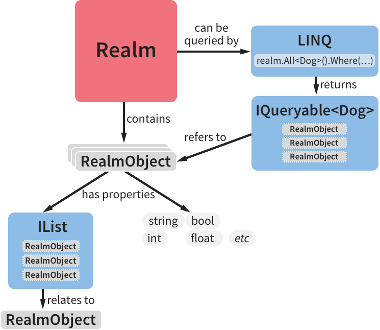

Realm .NET
=================

The C# API of Realm is incredibly simple because it leverages the power of LINQ for querying and the [Fody](https://github.com/Fody/Fody) weaver to transform plain C# class declarations into persistent objects.

The main classes you will use are:

- [Realm](xref:Realms.Realm)
- [RealmObject](xref:Realms.RealmObject)
- [Transaction](xref:Realms.Transaction)

Helper classes you may use are:

- [RealmConfiguration](xref:Realms.RealmConfiguration)

Querying and Sorting are provided on a [Realm](xref:Realms.Realm) using standard LINQ syntax including `Where` and `OrderBy`.
To see what is supported, refer to the [LINQ Support](linqsupport.md) page.

**Realm Overview Diagram**

Documentation
-------------
The documentation can be found at [https://www.mongodb.com/docs/atlas/device-sdks/sdk/dotnet/](https://www.mongodb.com/docs/atlas/device-sdks/sdk/dotnet/).

The API reference is located at [https://www.mongodb.com/docs/realm-sdks/dotnet/latest/](https://www.mongodb.com/docs/realm-sdks/dotnet/latest/).

Source
------
Source is available [on Github](https://github.com/realm/realm-dotnet).

Instructions on how to build from source are included in that repository's `README.md`.

Problem reports and Feature requests
------
The [github issue tracker](https://github.com/realm/realm-dotnet/issues) can be used to report problems or make feature requests.
