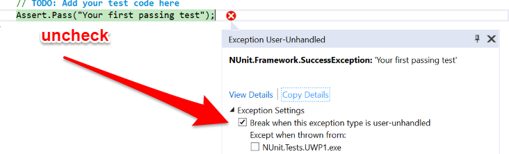

Tests Readme 
==========

Original Tests
--------------
The original `Tests.XamarinAndroid` and `Tests.XamarinIOS` projects build app using the UnitTest projects from Xamarin Studio, that invoke the NUnitLite test runner.

New Tests
---------

Test projects in here use the NUnit test runner using VS2017 or XS.

Building UWP target with ARM will run on a Lumia 950XL or similar device.

There's a new IOS project Tests.XamarinIOSn3 which uses NUnit 3

Because of extensive customisation, rather than using the `nunit.Xamarin` package, the runner is supplied by directly including the `nunit.runner.iOS` project.

Desktop Testing
---------------
You can run with x86 or x64 on the Local Machine to get a desktop version running, 

Note that a virtual Back button appears on the toolbar and is needed to navigate the UI. Other devices will use the hard or soft Back button (Android and Windows Phone) or add a top-left back. With the desktop version, even if you are running in a split screen mode, the back button still appears only on the left-hand side of the toolbar, next to the Windows logo. This may not be obvious and you can feel _stuck_ in the user interface.

Runtime Exceptions in Debugger
------------------------------
If running on the Local Machine you may find the debugger halting at a NUnit.Framework.SuccessException.

To suppress this, go into Debug - Options  and uncheck the Option
Break when exceptions cross AppDomain or managed/native boundaries.

You also need to expand that exception in the detail box on the debugger and disable the 
Exeption Settings - Break when this exception tyhpe is user-unhandled (maybe VS2017 only)

