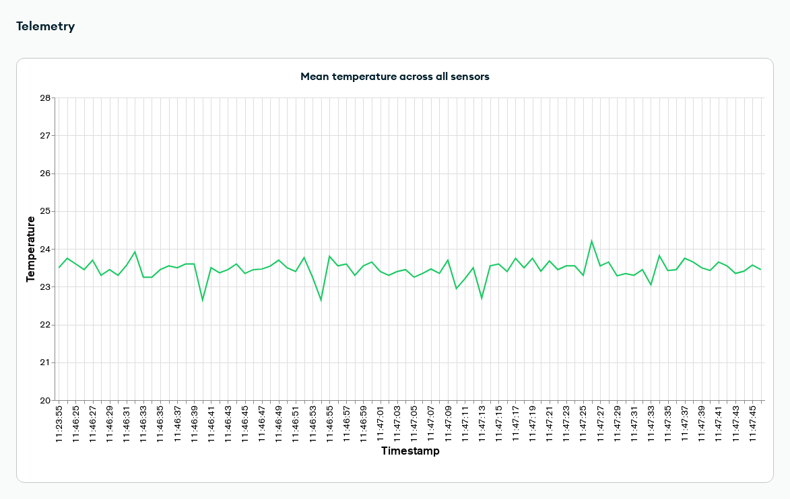

# AnalyticsTelemetry #

This example MAUI application shows how to use Realm for Analytics or Telemetry application, by using [Data Ingest](https://www.mongodb.com/docs/realm/sdk/dotnet/sync/asymmetric-sync/), and how to visualize the captured data using [Charts](https://www.mongodb.com/docs/charts/). Data Ingest can be used when you need to sync data unidirectionally to Atlas, for example with telemetry in IoT applications, or you need to write immutable data and do not need conflict resolution, for example when logging analytics events. 

In order to sync data unidirectionally to Atlas with the .NET Realm SDK, the objects that need to be synced must be declared as asymmetric object, using the [IAsymmetricObject](https://www.mongodb.com/docs/realm-sdks/dotnet/latest/reference/Realms.IAsymmetricObject.html) interface. Asymmetric objects follow some specific rules:
- Asymmetric objects can have embedded object ([IEmbeddedObject](https://www.mongodb.com/docs/realm-sdks/dotnet/latest/reference/Realms.IEmbeddedObject.html)) properties, but no other asymmetric object or realm object ([IRealmObject](https://www.mongodb.com/docs/realm-sdks/dotnet/latest/reference/Realms.IRealmObject.html)) properties.
- It is not possible to query, modify or delete asymmetric objects. Once an asymmetric object has been added to a realm, it cannot be accessed anymore, and the C# object itself cannot be used as well. 
- Asymmetric objects can only be used with [Flexible Sync](https://www.mongodb.com/docs/realm/sdk/dotnet/sync/flexible-sync/). As they cannot be queried, you do not need to add subscriptions to asymmetric objects.   

Aside from the aforementioned rules, asymmetric objects can be created and added to a realm in the same way as any other realm object. 

## Configuration ##

In order to run the example project you need to:
- Create an App in MongoDB Atlas and enable [Device Sync](https://www.mongodb.com/docs/atlas/app-services/sync/get-started/) on it. 
- Enable [Development Mode](https://www.mongodb.com/docs/atlas/app-services/sync/configure/sync-settings/).
- Enable [Anonymous Authentication](https://www.mongodb.com/docs/atlas/app-services/authentication/anonymous/). The example project use anonymous authentication for simplicity, but feel free to use the authentication provider you prefer. 
- Change `_appId` variable in `RealmService` to the App ID of the application you have created. 

## Analytics ##

The analytics part of the application simulates the generation of analytics events, using the `AnalyticsData` asymmetric object model:

```csharp
public partial class AnalyticsData : IAsymmetricObject
{
    [MapTo("_id")]
    [PrimaryKey]
    public ObjectId Id { get; set; } = ObjectId.GenerateNewId();

    public DateTimeOffset Timestamp { get; set; }

    public string EventType { get; set; }

    public Metadata Metadata { get; set; }
}

public partial class Metadata : IEmbeddedObject
{
    public Guid DeviceId { get; set; }

    public string Platform { get; set; }

    public int AppVersion { get; set; }

    public string Country { get; set; }

    public int Age { get; set; }
}
```
The `Metadata` property contains info related to the user and device from which we are logging the analytics. This is an example, and the object models could be more complex than this.

In order to run the example for analytics in the example app, click the "Analytics" button on the main page of the application.
In this page (corresponding to `AnalyticsPage.xaml` in the project, with the business logic in `AnalyticsPageViewModel.cs`):
- Clicking on the "Start" button will start the generation of analytics events, that are then added to a realm at uniform intervals. This is done by running the `AnalyticsGeneration` task.
- Clicking on the "Stop" button will stop the generation of events. 
- The lower part of the page will log the event generation as it happens. 
- It is possible to configure the analytics generation by modifying the value of the configuration fields at the top of `AnalyticsPageViewModel`, for example changing the number of users considered (`_numberOfUsers`), or the type of events (`_events`).

Finally, you can visualize the analytics events using [Charts](https://www.mongodb.com/docs/charts/), by selecting the `AnalyticsData` table as the data source. There are multiple kind of charts that can be generated from the data, depending on your needs, but here there is an example:


## Telemetry ##

The telemetry part of the application simulates the collection of temperature reading from sensors, using the `TemperatureReading` asymmetric object model:

```csharp
public partial class TemperatureReading : IAsymmetricObject
{
    [MapTo("_id")]
    [PrimaryKey]
    public ObjectId Id { get; set; } = ObjectId.GenerateNewId();

    public float Temperature { get; set; }

    public DateTimeOffset Timestamp { get; set; }

    public SensorInfo Sensor { get; set; }
}

public partial class SensorInfo : IEmbeddedObject
{
    public int Id { get; set; }

    public string Location { get; set; }
}
```

The `SensorInfo` property contains info related to the specific sensor. This is an example, and the object models could be more complex than this.

In order to run the example for telemetry in the example app, click the "Telemetry" button on the main page of the application.
In this page (corresponding to `TelemetryPage.xaml` in the project, with the business logic in `TelemetryPageViewModel.cs`):
- Clicking on the "Start" button will start the collection of temperature readings, that are then added to a realm at uniform intervals. This is done by running the `SensorCollection` task.
- Clicking on the "Stop" button will stop the collection. 
- The lower part of the page will log the temperature readings as they are collected. 
- It is possible to configure the temperature reading collection by modifying the value of the configuration fields at the top of `TelemetryPageViewModel`, for example changing the number of sensors considered (`_numberOfSensors`), or the collection interval (`_collectionDelayMilliseconds`).

Finally, you can visualize the analytics events using [Charts](https://www.mongodb.com/docs/charts/), by selecting the `TemperatureReading` table as the data source. There are multiple kind of charts that can be generated from the data, depending on your needs, but here there is an example:


