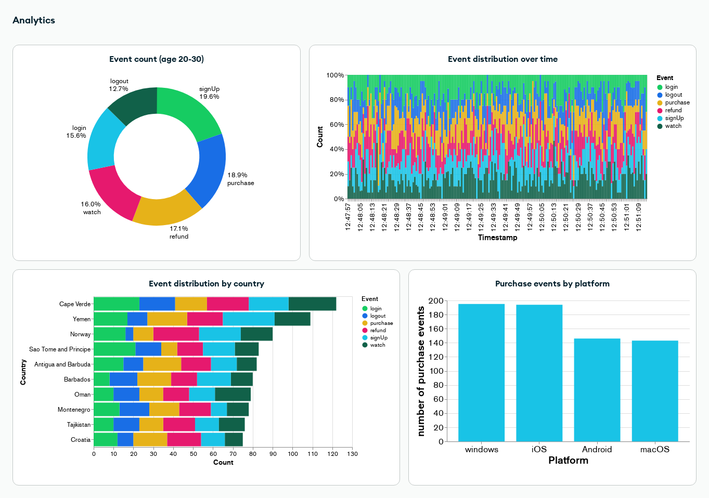
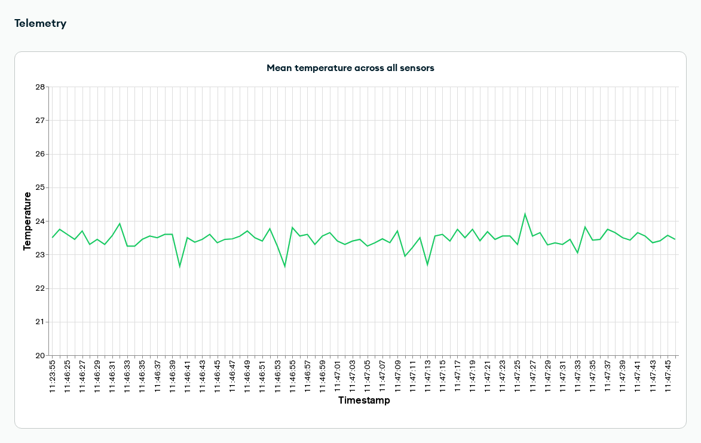

# AnalyticsTelemetry

This example MAUI application shows how to use Realm for an Analytics or Telemetry application, by using [Data Ingest](https://www.mongodb.com/docs/realm/sdk/dotnet/sync/asymmetric-sync/), and how to visualize the captured data using [MongoDB Charts](https://www.mongodb.com/docs/charts/). Data Ingest can be used when you need to sync data unidirectionally to Atlas, for example with telemetry in IoT applications, or you need to write immutable data and do not need conflict resolution, for example when logging analytics events. 

In order to sync data unidirectionally to Atlas with the .NET Realm SDK, the objects that need to be synced must be declared as asymmetric object, using the [IAsymmetricObject](https://www.mongodb.com/docs/realm-sdks/dotnet/latest/reference/Realms.IAsymmetricObject.html) interface. Asymmetric objects follow some specific rules:
- Asymmetric objects can have embedded object ([IEmbeddedObject](https://www.mongodb.com/docs/realm-sdks/dotnet/latest/reference/Realms.IEmbeddedObject.html)) properties, but no other asymmetric object or realm object ([IRealmObject](https://www.mongodb.com/docs/realm-sdks/dotnet/latest/reference/Realms.IRealmObject.html)) properties.
- It is not possible to query, modify or delete asymmetric objects. Once an asymmetric object has been added to a realm, it cannot be accessed anymore, and the C# object itself cannot be used either. 
- Asymmetric objects can only be used with [Flexible Sync](https://www.mongodb.com/docs/realm/sdk/dotnet/sync/flexible-sync/). As they cannot be queried, you do not need to add subscriptions to asymmetric objects.   

Aside from the aforementioned rules, asymmetric objects can be created and added to a realm in the same way as any other realm object. 

## Prerequisites

Developing .NET MAUI apps requires Visual Studio 2022 17.3 or greater, or Visual Studio 2022 for Mac 17.4 or greater. You also need to install the MAUI workload for the platform you are interested into. You can do this either through the Visual Studio UI or with the command line.

To install the workload with the command line:
- List all the available workloads with `dotnet workload search`
- Install a workload with `dotnet workload install *workloadName*`. 

For instance, if you're interested in the workload for all available platforms you can just do `dotnet workload install maui`. 

Once the workload is installed Visual Studio should ask you to install additional components if needed when the solution is opened. You can find additional information about how to install MAUI and support for specific platforms in the [official documentation](https://learn.microsoft.com/en-us/dotnet/maui/get-started/installation?tabs=vswin).

## Configuration

In order to run the example project you need to:
- Create an App in MongoDB Atlas and enable [Device Sync](https://www.mongodb.com/docs/atlas/app-services/sync/get-started/) on it. 
- Enable [Development Mode](https://www.mongodb.com/docs/atlas/app-services/sync/configure/sync-settings/).
- Enable [Anonymous Authentication](https://www.mongodb.com/docs/atlas/app-services/authentication/anonymous/). The example project use anonymous authentication for simplicity, but feel free to use the authentication provider you prefer. 
- Change `_appId` variable in `RealmService` to the App ID of the application you have created. 

## Analytics

The analytics part of the application simulates the generation of analytics events, using the `AnalyticsData` asymmetric object model:

```csharp
public partial class AnalyticsData : IAsymmetricObject
{
    [MapTo("_id")]
    [PrimaryKey]
    public ObjectId Id { get; private set; } = ObjectId.GenerateNewId();

    public DateTimeOffset Timestamp { get; private set; }

    public string EventType { get; private set; }

    public Metadata? Metadata { get; private set; }
}

public partial class Metadata : IEmbeddedObject
{
    public Guid DeviceId { get; private set; }

    public string Platform { get; private set; }

    public int AppVersion { get; private set; }

    public string Country { get; private set; }

    public int Age { get; private set; }
}
```
This part of the application is trying to simulate the logging of analytics events that could be generated from an application. In this case, for each event we are keeping track of the timestamp (`Timestamp` property), the type of event (`EventType` property) and information related to the user and device from which the event is originating (`Metadata` property). This is only an example, and the object models could be much more complex than this. For instance, the event type could be an embedded object itself in order to contain more information about the event, instead of being just a string.

In order to run the example for analytics in the example app, click the "Analytics" button on the main page of the application.
In this page (corresponding to `AnalyticsPage.xaml` in the project, with the business logic in `AnalyticsPageViewModel.cs`):
- Clicking on the "Start" button will start the generation of random analytics events, that are then added to a realm at uniform intervals. This is done by running the `AnalyticsGeneration` task.
- Clicking on the "Stop" button will stop the generation of events. 
- The lower part of the page will log the event generation as it happens. 
- It is possible to configure the analytics generation by modifying the value of the configuration fields at the top of `AnalyticsPageViewModel`, for example changing the number of users considered (`_numberOfUsers`), or the type of events (`_events`).

Finally, you can visualize the analytics events using [MongoDB Charts](https://www.mongodb.com/docs/charts/), by selecting the `AnalyticsData` table as the data source. There are multiple kinds of charts that can be generated from the data, depending on your needs, but here there is an example:



You can import the Dashboard shown in the screenshot by using the [`Analytics.Charts`](Charts/Analytics.charts) file in the `Charts` folder and following the instructions in the [documentation](https://www.mongodb.com/docs/charts/dashboards/#import-a-dashboard-from-a-file). 

## Telemetry

The telemetry part of the application simulates the collection of temperature reading from sensors, using the `TemperatureReading` asymmetric object model:

```csharp
public partial class TemperatureReading : IAsymmetricObject
{
    [MapTo("_id")]
    [PrimaryKey]
    public ObjectId Id { get; private set; } = ObjectId.GenerateNewId();

    public DateTimeOffset Timestamp { get; private set; }

    public float Temperature { get; private set; }

    public SensorInfo? Sensor { get; private set; }
}

public partial class SensorInfo : IEmbeddedObject
{
    public int Id { get; private set; }

    public string Location { get; private set; }
}
```
This part of the application is simulating the logging of random temperature reading from sensors. In this case, for each temperature reading we are keeping track of the timestamp (`Timestamp` property), the measured temperature (`Temperature` property) and information regarding the specific sensor (`SensorInfo`) property. This is only an example, and the object models could be more complex than this.

In order to run the example for telemetry in the example app, click the "Telemetry" button on the main page of the application.
In this page (corresponding to `TelemetryPage.xaml` in the project, with the business logic in `TelemetryPageViewModel.cs`):
- Clicking on the "Start" button will start the collection of random temperature readings, that are then added to a realm at uniform intervals. This is done by running the `SensorCollection` task.
- Clicking on the "Stop" button will stop the collection. 
- The lower part of the page will log the temperature readings as they are collected. 
- It is possible to configure the temperature reading collection by modifying the value of the configuration fields at the top of `TelemetryPageViewModel`, for example changing the number of sensors considered (`_numberOfSensors`), or the collection interval (`_collectionDelayMilliseconds`).

Finally, you can visualize the analytics events using [MongoDB Charts](https://www.mongodb.com/docs/charts/), by selecting the `TemperatureReading` table as the data source. There are multiple kind of charts that can be generated from the data, depending on your needs, but here there is an example:



You can import the Dashboard shown in the screenshot by using the [`Telemetry.Charts`](Charts/Telemetry.charts) file in the `Charts` folder and following the instructions in the [documentation](https://www.mongodb.com/docs/charts/dashboards/#import-a-dashboard-from-a-file). 
