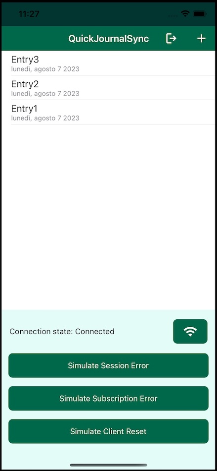

# QuickJournalSync

**QuickJournalSync** shows how to integrate Realm and [Atlas Device Sync](https://www.mongodb.com/docs/atlas/app-services/sync/get-started/) in a sample MAUI application, with particular focus on error handling, connection state changes and offline realms. This app is a synced version of [`QuickJournal`](https://github.com/realm/realm-dotnet/tree/main/examples/QuickJournal), so check that out if you are mainly interested in how Realm can be used effectively in conjunction with MVVM and data binding.

The app allows the user to keep a very minimal synced journal, where each entry is made up of a title and a body. Every time a new journal entry is added or modified it gets persisted to a realm, and thanks to the bindings the UI gets updated immediately, with no additional code required. The app uses Device Sync to keep the journal entries synchronised with MongoDB Atlas and other devices. 

Additionally, the app is built to show some common use cases when dealing with synced application:
- [How to open a realm while offline](#offline-synced-realm)
- [How to react to connection changes](#connection-state-changes)
- [How to handle errors](#error-handling)

## Prerequisites

Developing .NET MAUI apps requires Visual Studio 2022 17.3 or greater, or Visual Studio 2022 for Mac 17.4 or greater. You also need to install the MAUI workload for the platform you are interested into. You can do this either through the Visual Studio UI or with the command line.

To install the workload with the command line:
- List all the available workloads with `dotnet workload search`
- Install a workload with `dotnet workload install *workloadName*`. 

For instance, if you're interested in the workload for all available platforms you can just do `dotnet workload install maui`. 

Once the workload is installed Visual Studio should ask you to install additional components if needed when the solution is opened. You can find additional information about how to install MAUI and support for specific platforms in the [official documentation](https://learn.microsoft.com/en-us/dotnet/maui/get-started/installation?tabs=vswin).

## Configuration

In order to run the example project you need to:
- Create an App in MongoDB Atlas and enable [Device Sync](https://www.mongodb.com/docs/atlas/app-services/sync/get-started/) on it. 
- Enable [Development Mode](https://www.mongodb.com/docs/atlas/app-services/sync/configure/sync-settings/).
- Enable [Email/Password Authentication](https://www.mongodb.com/docs/atlas/app-services/authentication/email-password/).
- Change `_appId` variable in `RealmService` to the App ID of the application you have created. 

## Application structure

<p align="center">
    
</p>

The sample app is composed of 3 pages:
- `LoginPage`: it is the page that appears on the first startup of the application, where the user can sign up or login. After the user is logged in, the app transitions to the `EntriesPage`;
- `EntriesPage`: it is the main page of the application. On the top there is the list of the journal entries, and at the bottom there are 3 buttons that can be used to simulate different kind of errors. It is possible to delete entries or add new one by clicking the plus button in the toolbar. It is also possible to logout the current user by clicking the corresponding button in the toolbar, and this will make the app return to the login page.
The bottom part of the screen also contains a label that contains the current connection state, and a button to stop and resume sync.
- `EntryDetailPage`: it is the page where users can modify or create journal entries by specifying their title and body. 

There is only one realm object in the sample application, `JournalEntry`:
```csharp
public partial class JournalEntry : IRealmObject
{
    [MapTo("_id")]
    [PrimaryKey]
    public ObjectId Id { get; private set; } = ObjectId.GenerateNewId();

    [MapTo("userId")]
    public string UserId { get; set; }

    public string? Title { get; set; }

    public string? Body { get; set; }

    public DateTimeOffset CreatedDate { get; private set; }

    // This is only used to simulate a subscription error at the moment.
    public IList<string> Tags { get; } = null!;

    public JournalEntry()
    {
        if (RealmService.CurrentUser == null)
        {
            throw new Exception("Cannot create a Journal Entry before login!");
        }

        UserId = RealmService.CurrentUser.Id;
        CreatedDate = DateTimeOffset.Now;
    }
}
```

This object represent an entry in the journal, with a title, a body, a creation date, and the id of the user that created it. The model also contains `Tags`, that is only used to simplify simulating a subscription error, as we will see later.

Finally, `RealmService` is the class responsible for retrieving realms, logging in and out, and everything related to Device Sync as well.

## Offline synced realm

With Realm offline-first capabilities, it is always possible to read and write to the database even when using Device Sync, independently from the connection status of the app. In this section we are going to see how to open a synced realm, without needing to worry about connectivity.

There are two methods in the .NET Realm SDK that can be used to open a Realm: `Realm.GetInstance` (synchronously) and `Realm.GetInstanceAsync` (asynchronously). The two methods not only differ in asynchronicity, but have a different behavior when used to open a synced realm. We will first take a look at those two methods on their own, then show a recommended flow for opening a realm. 

### GetInstance

This method will return as soon as the realm has been opened. For this reason, this method can be safely used in the the majority of the application, as it works independently from the connection status. Once the realm has been opened, it will continue to synchronize in the background. 

### GetInstanceAsync

This method will complete after the realm has been opened and is fully synchronized. For this reason, this method is recommended to use only when it is essential to work with a fully synchronized realm, for example just after the first login of the user on a freshly installed application. 

The caveat with this method, though, is that it will continue to retry connecting to the server even if the device is offline, and could potentially run forever. In order to avoid this, you have two main possibilities:
- Use a cancellation token. The `GetInstanceAsync` method accept an optional `CancellationToken` variable as input, that can be used to cancel the operation after a maximum delay, like in the following example:
    ```csharp
    try
    {
        var cts = new CancellationTokenSource(4000);
        var configuration = new FlexibleSyncConfiguration(app.CurrentUser);
        var realm = await Realm.GetInstanceAsync(configuration, cts.Token);
    }
    catch (TaskCanceledException tce)
    {
        Console.WriteLine("GetInstanceAsync timeout");
    }
    ```
    This is the recommended approach in most of the cases, as it allows to configure the most appropriate timeout for the operation, depending on the specific application scenario.
- Set `CancelAsyncOperationsOnNonFatalErrors` to `true` on `FlexibleSyncConfiguration`. When set to `true`, async operations such as `Realm.GetInstanceAsync` or `Session.WaitForUploadAsync` will throw an exception whenever a non-fatal error, such as a timeout occurs. The timeouts can be customized by modifying the values in `AppConfiguration.SyncTimeoutOptions`, that contains a series of properties that control sync timeouts, such as the connection timeout and others. For example:
    ```csharp
    var appConfiguration = new AppConfiguration(config.AppId);
    appConfiguration.SyncTimeoutOptions.ConnectTimeout = TimeSpan.FromSeconds(4);
    app = Realms.Sync.App.Create(appConfiguration);

    // ....

    try
    {
        var configuration = new FlexibleSyncConfiguration(app.CurrentUser)
        {
            CancelAsyncOperationsOnNonFatalErrors = true
        };
        var realm = await Realm.GetInstanceAsync(configuration);
    }
    catch (Exception ex)
    {
        Console.WriteLine("GetInstanceAsync timeout");
    }
    ```
    In most cases this approach could be an overkill, as the exception would be raised for any kind of non-fatal errors, even for just a brief connection issue. For this reason it is recommended to use the previous approach, as it allows to retry in the specified time frame.

### Recommended flow

Given the differences between `GetInstance` and `GetInstanceAsync` that we have presented, here is an example of a recommended *logical* flow that uses both methods to open a realm, and that can be used in most applications:

```csharp
Realm realm;

if (app.CurrentUser == null)
{
    // There is no current user, so show the login screen and wait for the user to login.
    await PresentLoginScreen();

    var realmConfig = GetRealmConfig(app.CurrentUser);

    // Creates a CancellationTokenSource that will be cancelled after 4 seconds.
    var cts = new CancellationTokenSource(4000);

    try
    {
        // We get the realm asynchronously after login, with all the data synchronized.
        realm = await Realm.GetInstanceAsync(realmConfig, cts.Token);
    }
    catch (TaskCanceledException)
    {
        // If there are connectivity issues, get the realm synchronously
        realm = Realm.GetInstance(realmConfig);
    }
}
else
{
    var realmConfig = GetRealmConfig(app.CurrentUser);

    // The user is already logged in, so open the realm straight away
    // with the available data. If the application needs the latest
    // available data, then use GetInstanceAsync here instead.
    realm = Realm.GetInstance(realmConfig);
}
```
Please note that this snippet is here only to give an idea about the logical flow of obtaining a realm, but the actual code in your application could look different.

#### How the realm is opened in the sample application

The way that the sample application deals with offline realms loosely follows the snippet for the recommended flow that was shown in the previous section:
- When the application opens, the `LoginPage` is the first to be loaded.
- If the user is not logged in already (`CurrentUser == null`), then the user can specify their email and password and login. The login method (`RealmService.LoginAsync`) uses `Realm.GetInstanceAsync`, because we want to be sure to have a completely synchronized realm before showing the main page to the user:
    ```csharp
    public static async Task LoginAsync(string email, string password)
    {
        // ...

        await _app.LogInAsync(Credentials.EmailPassword(email, password));

        // Creates a CancellationTokenSource that will be cancelled after 4 seconds.
        var cts = new CancellationTokenSource(4000);

        try
        {
            using var realm = await Realm.GetInstanceAsync(GetRealmConfig(), cts.Token);
        }
        catch (TaskCanceledException)
        {
            // If there are connectivity issues, or the synchronization is taking too long we arrive here
        }
    }
    ```
- If the user just logged in, or was already logged in (`CurrentUser != null`), then we go to the main page (`EntriesPage`). Here, the method to open a realm (`RealmService.GetMainThreadRealm`) uses `Realm.GetInstance`, because we don't need to have the application completely synchronized before showing the main page.
    ```csharp
    public static Realm GetMainThreadRealm()
    {
        // ...
        _mainThreadRealm = Realm.GetInstance(mainThreadConfig);
        // ...

        return _mainThreadRealm;
    }
    ```

## Connection state changes

In order to react to connection state changes for the synchronization you need to subscribe to `realm.SyncSession.PropertyChanged` and look out for the `Session.ConnectionState` property, like in the following example:

```csharp
public static Realm GetRealm()
{
    var config = new FlexibleSyncConfiguration(CurrentUser);

    var realm = Realm.GetInstance(config);
    realm.SyncSession.PropertyChanged += HandleSyncSessionPropertyChanged;
}

// ...

private static void HandleSyncSessionPropertyChanged(object? sender, PropertyChangedEventArgs e)
{
    if (sender is Session session && e.PropertyName == nameof(Session.ConnectionState))
    {
        // React to connection state changes
        LogAndShowToast($"New connection state: {session.ConnectionState}");
        SyncConnectionStateChanged?.Invoke(null, session.ConnectionState);
    }
}
```

When reacting to connection state changes, please remember that those changes could be momentary, for example due to a drop in the internet connection of the device.

### Simulate connection state changes in the app

You can simulate connection state changes in the app by clicking the button next to the connection state label, that will stop and resume the sync session. The app will show a toast when the connection state changes, as well as show the current connection state in the bottom part of the main page.

## Error handling

There are different kind of errors that can happen when working on a synced application:
- [Subscription errors](#subscription-errors), that are raised when there are issues with subscriptions in Flexible Sync;
- [Session errors](#session-errors), that are raised when there is an issue with the synchronization or the connection;
- [Client reset errors](#client-reset), that are raised in exceptional cases when a client cannot sync data with the backend.

The sample application has been designed to show how to handle these different kind of errors. 

For an easier testing, there are 3 buttons on the main page, that simulate different kind of errors, so you can experiment with them. The app also logs to the console the corresponding exception, and at the same time shows a [Toast](https://learn.microsoft.com/en-us/dotnet/communitytoolkit/maui/alerts/toast?tabs=android) with the exception itself.
### Subscription errors

Subscription errors can happen when there is an issue with the subscriptions used in Flexible Sync, for example when trying to create a subscription for a property that is not in the list of [queryable fields](https://www.mongodb.com/docs/atlas/app-services/sync/configure/sync-settings/#queryable-fields). In the .NET SDK subscription errors are represented by the `SubscriptionException` class. 

When there is an error with the subscriptions, then `realm.Subscriptions.State` will be equal to `SubscriptionSetState.Error` and the corresponding exception will be available via the `realm.Subscriptions.Error` property. In general, after updating the subscription set, it is convenient to wait on `query.SubscribeAsync` to catch possible exceptions. Please note that if you are using the the old subscription API, then you will need to wait on `realm.Subscriptions.WaitForSynchronizationAsync`.

#### Simulate subscription error

Clicking on the *Simulate Subscription Error* button in the app will simulate a subscription error by subscribing to an unsupported flexible sync query. We then catch the exception and remove the invalid subscription from the set:

```csharp
try
{
    var unsupportedQuery = realm.All<JournalEntry>().Filter("{'personal', 'work'} IN Tags");
    await unsupportedQuery.SubscribeAsync(new SubscriptionOptions { Name = subErrorName });
}
catch (SubscriptionException ex)
{
    // Removing the invalid subscription
    realm.Subscriptions.Update(() =>
    {
        realm.Subscriptions.Remove(subErrorName);
    });
}
```

When using the old API, this is equivalent to:

```csharp
realm.Subscriptions.Update(() =>
{
    var unsupportedQuery = realm.All<JournalEntry>().Filter("{'personal', 'work'} IN Tags");
    realm.Subscriptions.Add(unsupportedQuery, new SubscriptionOptions { Name = subErrorName });
});

try
{
    await realm.Subscriptions.WaitForSynchronizationAsync();
}
catch (SubscriptionException ex)
{
    // Removing the invalid subscription
    realm.Subscriptions.Update(() =>
    {
        realm.Subscriptions.Remove(subErrorName);
    });
}
```

### Session errors

Session errors are raised due to different kind of events, such as adding an object outside of the current subscription set or when the server has received too many sessions from the client. In the .NET SDK session errors are represented by the `SessionException` class, that has an `ErrorCode` property to indicate the type of error. You can find more information about this in the [documentation](https://www.mongodb.com/docs/realm/sdk/dotnet/sync/handle-sync-errors/).

In order to handle session errors, you need to provide a `SessionErrorCallback` to the `FlexibleSyncConfiguration` object that is passed to `Realm.GetInstance` or `Realm.GetInstanceAsync`. For instance:

```csharp
public static Realm GetRealm()
{
    var config = new FlexibleSyncConfiguration(CurrentUser)
    {
        OnSessionError = HandleSessionErrorCallback,
    };

    return Realm.GetInstance(config);
}

//...

private static void HandleSessionErrorCallback(Session session, SessionException error)
{
    // Handle the error here.
    Console.WriteLine($"Session error! {error}");
}
```

#### Simulate session error

Clicking on the *Simulate Session Error* button in the app will simulate a session error by adding an object to the realm that is outside of the current subscription set, in this case a `JournalEntry` with a `User` that is not the current user.  

### Client reset

A client reset error is raised when a client realm cannot sync data with the application backend, for example in case of client/backend schema mismatch or re-enabling and disabling sync. When a client reset error is raised, clients may continue to write to the realm locally, but the changes will not be synchronized until the client reset is performed. The Realm SDKs provides methods to automatically handle client resets under most scenarios, and you can read more about that in the [documentation](https://www.mongodb.com/docs/realm/sdk/dotnet/sync/client-reset/). 

In order to handle session errors, you need to provide a `ClientResetHandler` to the `FlexibleSyncConfiguration` object that is passed to `Realm.GetInstance` or `Realm.GetInstanceAsync`. For example:

```csharp
public static Realm GetRealm()
{
    var config = new FlexibleSyncConfiguration(CurrentUser)
    {
        ClientResetHandler = new RecoverOrDiscardUnsyncedChangesHandler()
        {
            OnBeforeReset = HandleBeforeClientReset,
            OnAfterRecovery = HandleAfterClientResetRecovery,
            OnAfterDiscard = HandleAfterClientResetDiscard,
            ManualResetFallback = HandleManualReset,
        }
    };

    return Realm.GetInstance(config);
}

//...

private static void HandleBeforeClientReset(Realm beforeFrozen)
{
    // Callback invoked right before a Client Reset.
    Console.WriteLine("Before Reset Callback called");
}

private static void HandleAfterClientResetRecovery(Realm beforeFrozen, Realm after)
{
    // Callback invoked right after a Client Reset just succeeded.
    Console.WriteLine("After Reset Discard Callback called");
}

private static void HandleAfterClientResetDiscard(Realm beforeFrozen, Realm after)
{
    // Callback invoked right after a Client Reset that fell back to discard unsynced changes.
    Console.WriteLine("After Reset Discard Callback called");
}

private static void HandleManualReset(ClientResetException clientResetException)
{
    // Callback invoked if automatic Client Reset handling fails.
    Console.WriteLine("Manual Reset Callback called");
}
```

There are four different client reset handlers provided by the .NET SDK (`RecoverOrDiscardUnsyncedChangesHandler`, `RecoverUnsyncedChangesHandler`, `DiscardUnsyncedChangesHandler`, `ManualRecoveryHandler`), depending on the client reset strategy you wish to use. The client reset handlers provide different settable callbacks that are invoked at various stages of the client reset process.

The default client handler is `RecoverOrDiscardUnsyncedChangesHandler` that attempts to automatically recover any unsynced changes and, if it fails, it falls back to the discard unsynced changes strategy. You can read more about the different strategies in the [documentation](https://www.mongodb.com/docs/realm/sdk/dotnet/sync/client-reset/). 

#### Simulate client reset

The easiest way to simulate a client reset is to terminate and re-enable Device Sync, so clicking on the *Simulate Client Reset* button will just show a dialog reminding of this possibility.